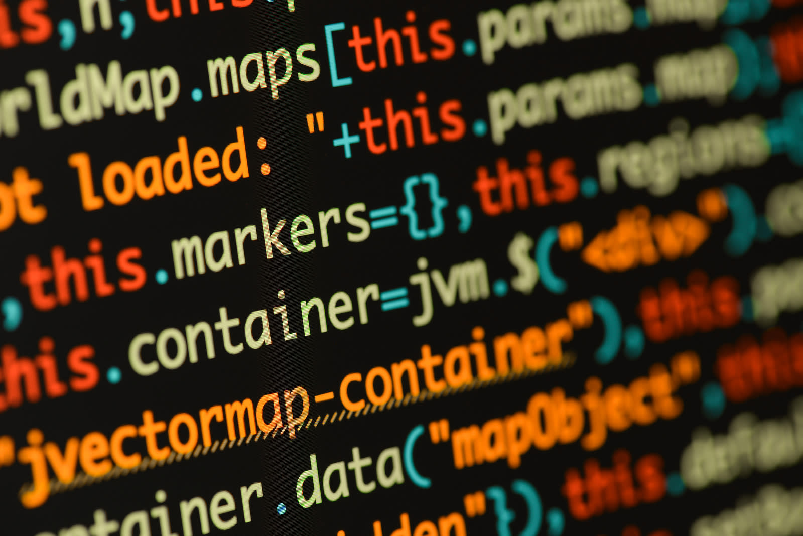

JavaScript currently stands as one of the most popular programming languages, serving as one of the main languages of the World Wide Web. According to W3Techs, 98% of all websites use JavaScript for client-side programming, making it an imperative language to learn for software engineers regardless of specialization. As an aspiring software engineer, I was properly introduced to JavaScript in my Software Engineering class, and I finally understand why it is used so heavily for the Web. I have had previous experience with JavaScript, but because I never fully committed myself to learning it, much about the language was confusing; however, after actually learning JavaScript syntax and concepts, I realize that it is quite a powerful language. Compared to other languages, JavaScript has many advantages, and it even makes “athletic” software engineering — solving timed software problems — much quicker and easier to produce.

## How does JavaScript compare?

One major standout of JavaScript compared to other languages like Java and C/C++ is its use of first-class functions. JavaScript treats functions (reusable pieces of code) as first-class citizens, meaning they can be passed as arguments to other functions, assigned to variables, and returned by other functions, among other things. This makes working with functions easier and provides more uses of functions, making certain tasks easier to complete. In addition, JavaScript is also a weakly-typed and dynamic language, using implicit type conversion and the keywords var, let, and const to declare variables instead of declaring them with their data type like in Java and C/C++. This makes comparisons much easier as the variables are assigned their data types at run-time (i.e., when the program starts running) and treated as different types based on the situation. Programmers can write programs much quicker while worrying less about type declaration and debugging for type errors (of course, dynamic and weak typing do have their drawbacks, like unpredictability, but the simpler typing makes programming much more efficient for programmers). The only other language I have experience with that shares these traits is Python, and the only notable difference from JavaScript is its more “readable” syntax. JavaScript’s ease of use helps with creating programs, especially when those programs have time constraints.

## JavaScript in action

In my Software Engineering class, we are assigned Workouts of the Day (WODs). WODs are coding problems to be solved in a limited amount of time. The WODs teach us students quick problem solving skills, which I find useful for employment preparation. I also enjoy creating programs and algorithms to solve problems (making the completion of WODs more enjoyable and satisfying), but the strong typing and strict syntax of languages like Java makes the coding process longer; however, JavaScript's weak typing allows me to focus less on specific coding details and more on implementation of my solution, saving time and brain power for the more important things (potentially at the cost of readability and form, of course). Certain JavaScript capabilities allow for much quicker and cleaner solutions to WODs. For example, Professor Philip Johnson of the University of Manoa at Hawaii provided the following function to determine if a string has repeating characters:

```
function isUnique(str) {
  let chars = {};
  for (let i = 0; i < str.length; i++) {
    if (chars[str[i]]) {
      return false;
    }
    chars[str[i]] = true;
    }
  return true;
}
```

In the above function, an empty object ```chars``` is created. A ```for``` loop iterates through the string and looks for each character in the ```chars``` object. If it is found (as in, if the string already contains that character), the function returns ```false```. If not, the character is added to the ```chars``` object, and the program returns ```true``` if all characters are unique. The ability for JavaScript to access attributes in an object and add attributes to an object with such simple syntax allows for a clean and efficient solution to the problem of finding duplicates in a given string. Simplifying complex tasks and decreasing overall time spent coding makes JavaScript such a powerful language.

## Conclusion

My inevitable introduction to JavaScript (as a software engineer, it was bound to happen eventually) was a very positive one. Its functionality and convenience stood out to me, especially transitioning from Java. Completing athletic software engineering problems using JavaScript further highlights the language’s strengths and abilities. Learning JavaScript was a major stepping stone on my way to becoming a full-fledged software engineer, and I am now much more confident in entering the industry that uses such a good language. With JavaScript serving as its backbone, it is no wonder that the Web is as great as it is.
