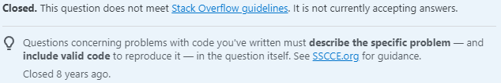

According to Carl Sagan, “there is no such thing as a dumb question”. As he says, all questions are asked to gain an understanding of some topic. While it might be true that no question is inherently dumb, what could impact the way a question is answered or received is how it is asked in the first place. As with any other field, inquiries and requests in computer science should be asked properly in order to receive desirable answers. If a software engineer has an issue and seeks help ineffectively, the responses to their questions and requests will likely be unfavorable and unhelpful to the engineer. On the other hand, questions that are asked in effective ways are more likely to have answers that actually help the engineer and solve the issue at hand. In an essay titled, “How To Ask Questions The Smart Way”, software developer Eric S. Raymond describes that exact “smart” way to ask questions, including best practices and what to avoid or be mindful of. Below are two questions, one meeting the expectations of a “smart” question and the other violating the principles discussed by Raymond.

## The Smart Way

In <a href="https://stackoverflow.com/questions/411752/best-way-to-repeat-a-character-in-c-sharp">this question</a>, the user asks for the best way to repeat a character (specifically, the \t character) in C#. They preface the question by saying that they are “learning C# and experimenting with different ways of saying the same thing”. To specify the answer being looked for, the user elaborates on their question and provides three methods to repeat characters and explains the benefits and drawbacks of each method: the short LINQ version that could be consuming too much time/space with calls to the Repeat and Aggregate functions; the clear StringBuilder version, in which the user questions the possibility of the StringBuilder class being slower; and the basic and easy-to-understand string concatenation. The user even raises the possibility of the time/space differences being arbitrary (i.e., each version is equal) to provide the ability for more precise answering. Also provided in their question is the code for each version listed above to ease the process of comparing, further raising the chance of getting a proper answer.
```
private string Tabs(uint numTabs)
{
    IEnumerable<string> tabs = Enumerable.Repeat("\t", (int) numTabs);
    return (numTabs > 0) ? tabs.Aggregate((sum, next) => sum + next) : ""; 
}  

private string Tabs(uint numTabs)
{
    StringBuilder sb = new StringBuilder();
    for (uint i = 0; i < numTabs; i++)
        sb.Append("\t");

    return sb.ToString();
}  

private string Tabs(uint numTabs)
{
    string output = "";
    for (uint i = 0; i < numTabs; i++)
    {
        output += '\t';
    }
    return output; 
}
```
The question has most or all of the qualities of a “smart” question described by Raymond, like being explicit, precise and informative, and describing the overall goal of the question rather than the issue. Because the question was so clear, others knew how to answer the question better, even providing more efficient solutions to the original question that were not originally included. Such competent and helpful responses were only possible because the question itself was asked in such a competent way, stressing the need to ask “smart” questions.

## The Less Smart Way

Meanwhile, <a href="https://stackoverflow.com/questions/20574925/c-file-homework">this question</a> asks for help on a homework assignment about a student record simulation in C, reading a file for a student’s numeric grades to be converted to letter grades and printed along with other information about the student. Already, this question goes against Raymond’s principle of not posting homework questions, but the question also includes the user’s program and asks for help to make it work without describing the issues in their program. Before providing his entire coding solution rather than a specific piece, the user simply writes, "This is what I have. Can you please help me?". The title, “C File Homework”, also lacks information regarding the problem, leaving more ambiguity in the exact question being asked. Numeric reactions aside – the question is at a net 5 downvotes as of September 7, 2022 – answers to the question are also limited and not very helpful. Other users even pointed out that describing the problem as “it did not work” is unhelpful and undescriptive, making it harder to answer the question precisely. Unlike the “smart” question, which received much positive feedback and helpful responses, this question was received negatively and resulted in many answers that did not help the problem or only answered part of it. Due to the way in which it was asked, the question lacked competent answers and was closed for further answering.



## Bottom Line

While there may not be dumb questions, there are definitely smart ones – rather, there are smart ways to ask questions in order to elicit desirable responses. While the first question was met with favorable responses, due to the nature of the question and the way it was presented, the second question lacked clarity and competence and, as a result, hindered any helpful answers from being made. From these two questions, it is abundantly clear that asking in a “smart” way – paying attention to detail, clarity and precision, as well as having the attitude to help find a solution instead of relying on others to solve the entire problem themselves – is important when expecting proper answers. In software engineering (and everywhere else), questions that are clear and easy to answer will be answered, while questions that are vague and hard to answer will not be answered. As the field continues to advance and new technologies are created, software engineers around the world will undoubtedly have new questions about them; what separates the ones who make it from the ones who fall behind in this ever-evolving world is how they ask these questions.
