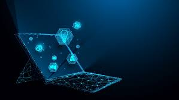
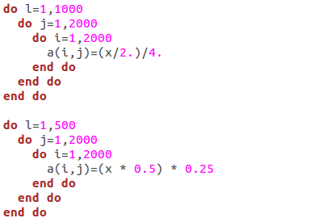

Computers are the future. Nowadays, computers and internet services are prevalent in daily life, from navigation to entertainment to research. Approximately five billion people around the world use the internet, and as accessibility to the internet increases, that number will only grow, making computers even more important. Evidently, I am one of those five billion people, as I rely heavily on computers and the internet for my personal and professional life; without either of the two, you would not be reading this essay. The online services and websites I use in my daily life are possible because of software engineering. Search engines, websites, Among Us - such a wide variety of applications and systems can be formed from software engineering. It is because of the seemingly endless possibilities that I aspire to be a software engineer myself. From design and development to workplace skills like teamwork and communication, I enjoy software engineering and desire to learn all I can about the field.

## The Wonderful World of Programming

Initially, programming was a complex idea for me to understand. I was unable to process the irregular syntax and confusing concepts, so I always avoided learning it (perhaps part of the complexity arises from learning C++ first); however, after pushing myself to learn, the ideas suddenly clicked, and I realized how enjoyable programming actually is. Now, as I pursue a computer science degree, I look forward to programming for assignments and learning new languages in class. I enjoy programming during my free time, creating small projects and solving Leetcode problems. At the risk of sounding childish, programming gives me the feeling of living in the future: I am creating the future on a machine that represents “the future” to my parents’ generation. Of course I also put effort into learning theoretical concepts, but I mainly focus on how I can apply those concepts to programming. Although being a software engineer entails much more, I greatly look forward to the programming aspect.

## Code Versus Good Code

There is a difference between code and good code. Because it is a passion of mine, I strive to create the latter, so I seek optimization. Whether it be cleaner and more efficient code, or user-side improvements like user interface optimizations, I always look for ways to improve my code. When I learn faster or nicer ways of doing something, I try to apply it to whatever program I am working on to optimize it. There are benefits of optimization for users, so it is a useful skill for software engineers, but optimization is something that I find interesting and helpful regardless of whether I am employed.

## Looking Forward

As a student, I still have much to learn. In order to be a great developer in my own right, I constantly seek to improve my technical and problem solving skills. Additionally, as teamwork and communication are vital to succeeding as a software engineer, I hope to develop my interpersonal and team skills. I also plan on advancing far enough in software engineering to lead my own teams, in which management skills would be very important to develop. All of that will come in due time, but for now, I will keep my passion for computers strong for the role they play in my life, in others’ lives, and in the future of our world.
