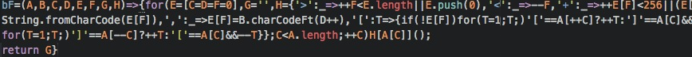

Picture this: you are a software engineer working on a team project. One team member, no matter how hard they try, just cannot get their code to work. No amount of brainstorming, debugging, or StackOverflow surfing on their end is working, so they decide to ask for your help. Upon requesting to look at their code, you are presented with a screen full of lines like this:



Naturally, someone without programming knowledge would have trouble understanding it; however, even programmers would struggle with understanding such messy code. Though it is an extreme example of messy code, there are many programs that look like this, or worse. Many programmers overlook the importance of coding standards and clean code, adopting an "if it works, it works" mentality. The program is functioning as expected and there are no bugs, so why waste time making it look nicer? Consider teammates and future employees who have to read this code: are they able to understand how it works in the way it is written? If any changes are required to this code, would they be able to implement such changes? Would they be able to provide any sort of help without understanding the code? This is where coding standards and clean code come in. Emphasizing readability as much as functionality by conforming to coding standards benefits not only the programmer, but also those who have to work with what the programmer creates.

## The Importance of Coding Standards

Programming, especially in languages like Java and C/C++, is already difficult to read, as programming syntax is very different from spoken and written language. As such, programmers often struggle with deciphering programs, which is only exacerbated by poor and messy programming. Even programmers who create messy code may have trouble reading their own programs, making any needed changes much harder to implement and decreasing efficiency. Of course, during timed events, such as athletic programming and competitions, speed is valued over form, so programmers write programs quickly without paying much attention to the "look" of their program; however, the software industry itself functions much differently and values high quality and cooperative code that is easy to maintain and modify. 

The desire to increase readability and efficiency led to the implementation of coding standards. By conforming their code to coding standards, programmers can write code that functions properly and looks clean, satisfying both customers and developers. When modifications to source code are required, the readability of standardized code makes the modification process much faster, thereby more efficient (while it could be argued that fixing code to conform to standards slows modification down,  the gains in time from standardized code far outweigh the slight losses). Using consistent and proper spacing and breaking lines where they should be broken allows others viewing the program to discern which variables are which, which pieces belong to which blocks, which functions are being called, etc. Descriptive variable names explain the purpose of each variable and what they do in the program. Naming conventions keep variable names uniform and make variable declaration much easier in the event that new variables are needed for a specific program. In the case of ESLint for javascript, the constraint of ```let``` and ```const``` in place of ```var``` to declare variables ensures proper scoping, unique variable declaration, and immutability as needed, further decreasing any potential confusion. The use of type-safe equality operators ```===``` and ```!==``` ensure proper comparisons between different data types, decreasing any ambiguity provided by comparison (thus, increasing efficiency and readability).

Coding standards can even help with learning new programming languages. Teaching a language with visually pleasing standardized code gets concepts across to learners much better than messy and confusing code. Instead of spending time trying to understand what they are presented with, programmers can focus more on the implementation of a certain feature, the use of a certain keyword, overall structure of a program written in that language, et cetera in code that is easier to read, making their learning much faster and better. For instance, examples that use frequent explanatory comments, descriptive variable names, and an easy-to-read format will present a language's capabilities much clearer than examples that barely explain functionality and use variable names like ```i``` or ```x``` in a jarring format (e.g., inconsistent spacing, continuous lines of code). New learners may even pick up bad programming habits from bad examples that are hard to get rid of, causing more trouble for any teams they work with. In my example of ESLint's type-safe equality operators, forcing the use of ```===``` taught me the nuances of the operator and when to use ```===``` versus the standard ```==``` operator.

## A Method to the Madness

Coding standards are by no means trivial. They enforce specific programming procedures and practices, in turn improving readability and efficiency. Code that is easy to read and debug is much easier to maintain than code that is messy and complex. Instead of thinking about coding standards as nitpicky details that tell you how many times to space and tab, what kinds of operators and variables to use, where to place curly braces and declarations, think of them as a way to help teammates and improve yourself as a programmer. As Lord Polonius says in Shakespeare's <em>Hamlet<em>, "though this be madness, yet there is method in 't."
