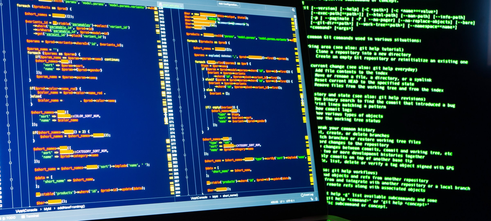

Another semester, another high-stress preparation period for finals week --- scratch that, another high-stress 16 weeks. As I seek to wrap up my undergraduate studies and graduate next Spring semester, before moving on to full-time graduate school for University of Hawaii's five-year Bachelor and Master Program, this semester has seen one of my highest workloads, and ICS 414 played a major part. Given the scale of the project the class was assigned to convert from React Semantic UI to React Bootstrap and the --- no offense to the original developers of the project --- somewhat poor codebase, I had my work cut out for me. Combine that with the entire semester between taking ICS 314 and ICS 414, and you get long, frequent periods of coding and review (of a framework and an entire programming language) on the fly. At the same time, however, ICS 414 is one of the best courses I have taken throughout my college experience in terms of enjoyment and practicality. Something about working on pieces of application design alongside team members and seeing it all come together to form a working project is so satisfying. Working with a project hands-on and seeing a piece of code visually come to life is also a wonderful sight.

## The People

Part of my ICS 414 experience was made enjoyable by the great team to which I was assigned. All team members kept in regular contact, making it easy to discuss project details and design choices remotely. We each had our assigned pages and components and tasks, and though some members admittedly tended to procrastinate, we still managed to get everything done on time. Since I had taken ICS 414 relatively long after ICS 314 (as in, Fall 2022 to Fall 2023), my knowledge of JavaScript, React, and GitHub had deteriorated quite a bit. Thankfully, my team members were more proficient in using these tools and were a great resource for help. Were it not for them, working on the project would have been much more difficult.

## The Project

This brings me to the project itself. On the one hand, working with JavaScript and the other web languages again was really fun. JavaScript is quite unique, with features like weak typing and arrow functions, making it a fun language to use. React Bootstrap has a wide array of styling options to choose from, making the UI design aspect of the project easier (this, of course, does not save you from just having poor UI design skills, evident in my attempts at UI). The use of Mongo in Meteor also made databasing and collection handling quite efficient and straightforward, while still teaching me plenty about general database management.

On the other hand, it was quite difficult to work with the codebase our class was given. Many of the components and pages had redundant code, inconsistent naming, and weird design choices, to name a few. Some of the pages were just not working correctly, if at all. Alongside just converting the pages from Semantic UI to Bootstrap, we were also tasked with fixing these functionality issues and UI choices.The actual conversion of these pages, both from Semantic UI to Bootstrap and from class-based to arrow function-based components, was also troublesome. Some components were implemented differently in each framework, and others were native to Semantic UI, requiring replacement by a similar component from Bootstrap. Converting from classes to arrow functions also has its difficulties, as React concepts like withTracker and states are implemented differently between classes and arrow functions. The magnitude of the project also meant a lot of refactoring, a lot of converting, and a lot --- and I mean a <u>lot</u> --- of testing. All things considered, this project was actually quite challenging.

It may sound like complaining (which, honestly, I slightly was), but I actually enjoyed the challenge. My knowledge of JavaScript and the React framework has grown considerably. I can use GitHub and GitHub Desktop more confidently and efficiently --- and I know when <u>not</u> to create a pull request on a directory from which my project is forked. My teamwork and communication skills were constantly employed and improved upon, which will benefit me in the surely interpersonal career I have in the future. I dare say that I have even gotten slightly better at UI design (I am delusional), and I have a much greater understanding of coding for multiple platforms and displays.

## Through It All

Overall, my experience in ICS 414 was quite positive. It was nice to take a break from the theory-heavy nature of the classes I am taking and assisting with (refer to my resume section) by working on interactive front-end design. My biggest takeaway from this course is how much I truly value consistency, which I will be sure to display  in the workforce. As one of my career interests is software development, the coding and software engineering experience I have gained from this course will no doubt come in handy and serve me for many years to come, and I may even rely on some of the ICS 414 project in personal software development endeavors. I started ICS 414 with an almost insurmountable task to complete, and through it all, I emerged a better developer. To my future employers, your code is in good, ICS-414-passing hands.
