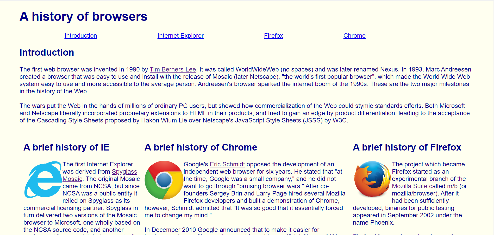
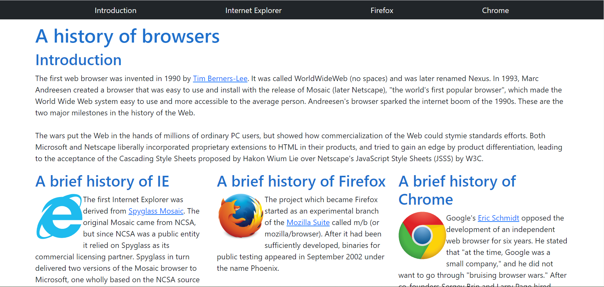
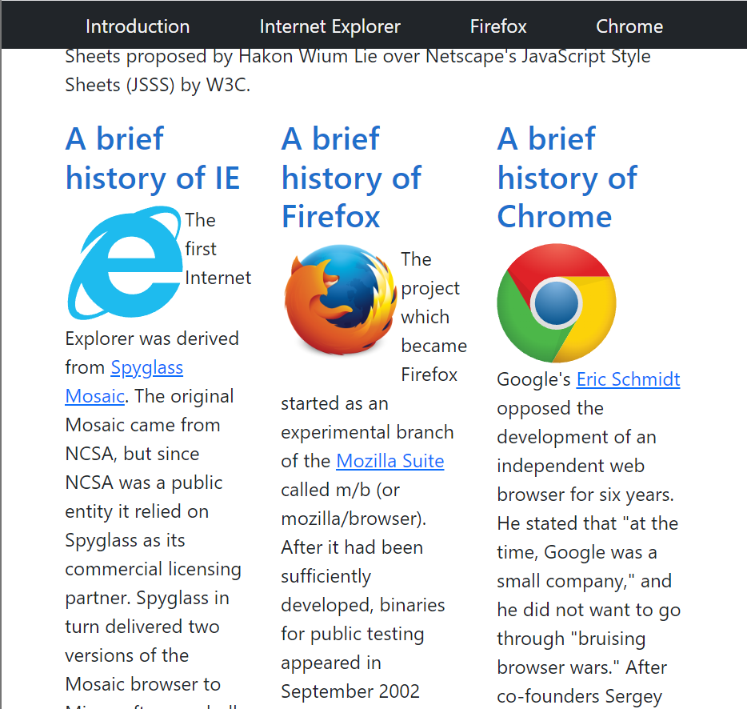

HTML and CSS are the languages of the Web. HTML lays the basic foundation of a page and CSS heavily supports the page with its styling capabilities. Going hand-in-hand, these two languages create almost the entirety of the, but there is a problem: styling with CSS alone is quite difficult. Tasks like changing the basic structured format of HTML to simply spacing and placing elements properly is arduous and confusing to implement in a visually appealing manner with pure CSS. HTML cannot rely solely on CSS for visual appearance; with a language as awkward as CSS, HTML requires extra framework to support the look of its pages. UI frameworks provide CSS classes and Javascript functions to ease the process of web design. Adding visually appealing styling and automatic formatting, frameworks abstract much of the difficulty that goes into making a web page. Basic CSS can even work with frameworks to specify a design that the framework does not supply or to edit a framework class.

## Boostrap

One such UI framework is Bootstrap. Bootstrap emphasizes responsive development, which allows the display of a web page to change depending on the size of the screen from which it is being displayed. To do this, Bootstrap facilitates the implementation of resizing and reformatting web pages when the window is resized or when a smaller screen is used to view a larger web page (most notably on mobile devices). 

Using Bootstrap itself is by no means easy, what with having to learn the names of the provided classes and their uses, how to properly format subcomponents in larger ones, what can and cannot be formatted with Bootstrap. The positioning of components can be messed up by using a class in the wrong HTML element, classes can sometimes operate differently from how you expect or want them to operate, omitting certain classes entirely ruins the entire display of the page. Learning Bootstrap could even be attributed to learning a new coding language, so there is definitely a learning curve involved. Once you do learn how to use Bootstrap, however, it becomes a very powerful framework. For example, one Bootstrap class, the ```container```, adds automatic padding and margins to its components (relative to the root element), spacing them from the edge of the screen (as they usually appear in HTML). To further manipulate spacing, components can use the ```p``` and ```m``` classes followed by a dash and a number to change their padding and margins, respectively. Additional specifiers can precede the dash to restrict the padding/margin to one direction/plane (e.g., ```px-2```; more information can be found <a href="https://getbootstrap.com/docs/4.0/utilities/spacing/">here</a>). The easy-to-implement spacing classes are just one example of Bootstrap's abstraction of styling, saving developers from having to manually space elements themselves and fiddle with the exact spacing of elements.

## Bootstrap in Action

Provided below is a web page styled with basic CSS:



The web page consists of a horizontal navigation bar, an introduction section, and 3 columns of text. Not much is going on with the website, and subjectively speaking, it is not very appealing; the website is very basic. CSS was used to style the color of the background and text, format the horizontal navigation bar, and split the text into columns, but the navigation bar is off-center and the central Chrome column is wider than the other two columns. Meanwhile, here is the same web page styled with Bootstrap 5:



Compared to the CSS page, the Bootstrap page is much more uniform and visually appealing. Bootstrap's ```navbar``` class makes navigation bars much easier to implement (as seen with the black bar on the top). The entire body element is placed in a ```container``` class, adding the uniform padding that had to be manually specified in the CSS page. Using Bootstrap's grid system, the columns of text are evenly sized and spaced.

Previously mentioned was Bootstrap's emphasis on responsive web design. Provided below is a minimized screen displaying the CSS web page and Bootstrap web page, respectively:




In a smaller screen, the CSS page becomes jumbled, with the columns getting thrown out of place. The middle and right columns are forced under the left one and begin to interlace. Meanwhile, the Bootstrap page remains uniformly formatted in a smaller screen, with the navigation bar and the columns resizing appropriately. Not shown in the CSS page image is the navigation, which does not resize like the Bootstrap bar does.

## Conclusion

Bootstrap is initially hard to use. Invoking everything with classes is different from standard CSS styling, and having to learn the name and functionality of each class can be difficult. Some classes need to be manipulated to produce desirable results. Learning Bootstrap may be a task in and of itself, but the results speak for themselves. Do not let the difficulty of framework development keep you from using such a powerful tool. After all, there are no shortcuts to excellence.