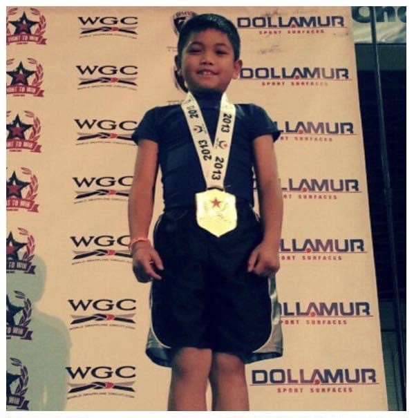
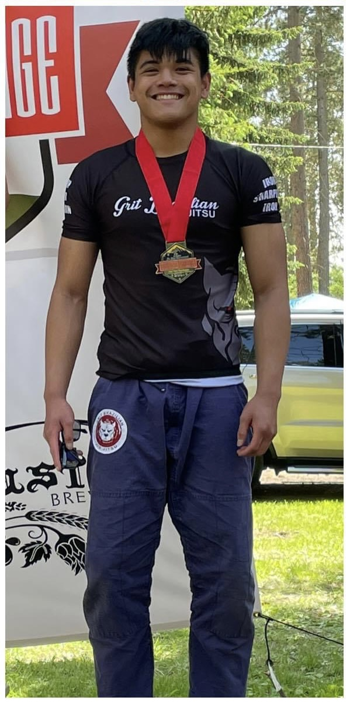

It may not a coding project, I have been working on a long-time "project" of practicing Brazilian jiu-jitsu (BJJ). After doing taekwondo for three years, I decided to switch to BJJ in 2012 after a visit to the island of Hawaii, where I watched my cousin, a BJJ practitioner, in action at a class taught by BJJ black belt and former mixed martial artist B.J. Penn. Since then, I have been doing it as a hobby and physical activity, even participating in competitions. Giving me the confidence and ability to defend myself, as well as the discipline to not hurt others outside of self-discipline, I feel like BJJ is an important part of my life that contributed to who I am today.

## Competing

Much of my time training is spent improving my technique and expanding my skillset so that I can perform well at BJJ competitions. Like a standard martial arts tournament, BJJ competitions often involve brackets of fighters sparring against each other to win, either through points or submission. My first competition was in 2013, not too long after starting BJJ, and my latest one was in the summer of 2021. I participate in competitions as a way to measure how my skills have improved, and because of how fun and exhilarating they are. Getting to watch your teammates spar with other people while cheering them on or guiding them makes the competition space very lively. Losses give you opportunities to learn on what you need to improve, and the sense of winning is very thrilling and rewarding. Of course, competing makes me nervous, but once I'm in the round, I forget about my anxiety and enjoy the match.

 

## Lifestyle

Even outside of training for competitions, I like training and being on the BJJ mats. I have an active lifestyle and enjoy working out, so I go to my BJJ classes just to provide myself with some form of physical activity. I also feel more confident having the ability to defend myself in some way, even if only a little. The BJJ community is also (largely) nice and welcoming, and I have never met an unfriendly person on the mat so far (hopefully it never comes to pass). There are some bad apples out there though (as with anything), but the BJJ community, being so relatively new and small, is positive overall.

## Today

As of November 2023, I am a blue belt (the belt system for adults is white, blue, purple, brown and black), but I hope to reach the rank of black belt and potentially teach others what I have learned through my years of training.

