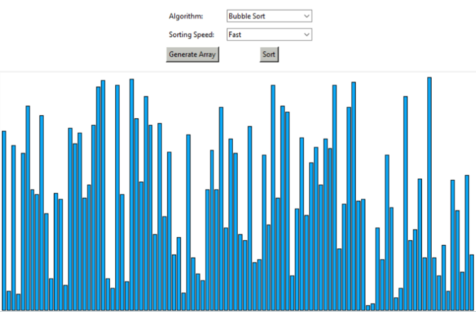
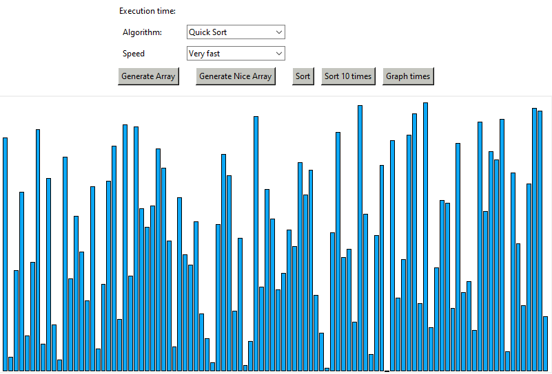

Sorting algorithms have intrigued me since my initial discovery of them. I enjoyed watching them in action and learning about their functionality, as well as efficiency and uses. From my interest in sorting algorithms, I stumbled upon <a href="https://python.plainenglish.io/build-a-sorting-algorithm-visualizer-in-python-f6f4afb1c98a">this website</a> for making a sorting algorithm visualizer in Python using Tkinter. Provided below is some of the programming from the website for making the visual array:

```
data = []

# This function will draw randomly generated list data[] on the canvas as vertical bars
def drawData(data, colorArray):
    canvas.delete("all")
    canvas_width = 800
    canvas_height = 400
    x_width = canvas_width / (len(data) + 1)
    offset = 4
    spacing = 2
    normalizedData = [i / max(data) for i in data]

    for i, height in enumerate(normalizedData):
        x0 = i * x_width + offset + spacing
        y0 = canvas_height - height * 390
        x1 = (i + 1) * x_width + offset
        y1 = canvas_height
        canvas.create_rectangle(x0, y0, x1, y1, fill=colorArray[i])

    window.update_idletasks()

# This function will generate array with random values every time we hit the generate button
def generate():
    global data

    data = []
    for i in range(0, 100):
        random_value = random.randint(1, 150)
        data.append(random_value)

    drawData(data, [BLUE for x in range(len(data))])

```

## My Additions

Of course, I cannot call it "my project" without adding to the program in some way. The original tutorial only included Bubble Sort and Merge Sort, so from various online resources and knowledge gained from my computer science classes, I added more sorts, like QuickSort and Selection Sort. I added a feature to generate a uniform array for sorting instead of a completely randomized array each time (inspired by those sorting algorithm videos on YouTube). In addition, I added a feature to graph the various sorts using Pyplot, as I also wanted a visual comparison of the algorithms. 



As of right now, this project is still ongoing. The code itself needs to formatted nicer, and many visual/layout improvements can still be made. I hope to add more sorts and features as my knowledge grows.

