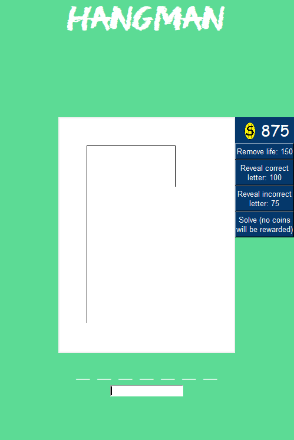

I created a graphical hangman game with added functionality for the Create Task portion of the AP Computer Science Principles course. The project is written entirely in Python and utilizes the Tkinter GUI interface. Provided is some of the GUI programming required to display the (very crude) screen above:
```
self.letter_frm = tk.Frame(self.game_frm,width=100,height=400,bg="#5cdb95")
self.letter_frm.grid(row=2,column=0)
self.letter_frm.pack_propagate(0)

self.letters = tk.Message(self.letter_frm,width=100,fg="white",bg="#5cdb95")
self.letters.pack()

self.canv_frm = tk.Frame(self.game_frm, width=300,height=400)
self.canv_frm.grid(row=2,column=1)
self.canv_frm.pack_propagate(0)
self.canvas = tk.Canvas(self.canv_frm, width=300,height=400)
self.canvas.pack()
self.turtle = draw.Drawer(self.canvas)
self.turtle.draw()

self.power_frm = tk.Frame(self.game_frm,width=100,height=400,bg="#5cdb95")
self.power_frm.grid(row=2,column=2)
self.power_frm.pack_propagate(0)
```

## How To Play

A blank word is given to a player, who then enters letters in an attempt to guess the word. For each correct letter guessed, the game inputs the letter in the correct position(s) of the word; for each incorrect letter, a portion of a hanging stick figure is drawn. If players correctly guess the word, they win the round and are awared coins. If players are unable to guess the word before the full hangman is drawn, they lose. Players can select from three difficulties to play in, with each difficulty changing the length and complexity of the potential word being played and the amount of coins awarded for winning. Power-ups can be bought using the coins awarded, allowing the player to erase parts of the hangman, display a correct letter, or display incorrect letters. 
