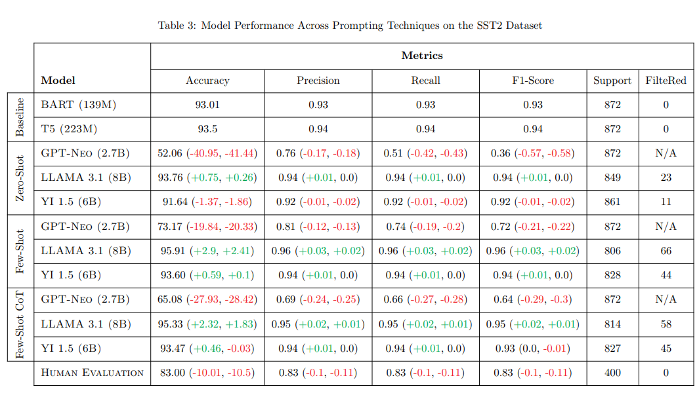

Natural language is complex, requiring levels of nuance and context to achieve full comprehension, even for humans. Language models lack this nuanced understanding---or any inherent understanding of language, for that matter. As a result, they often struggle with tasks like text classification and sentiment analysis, which rely on contextual understanding of the words and phrases being classified. Large language models (LLMs) achieve a better general "understaing" of language, but the training required to reach that level of comprehension is very expensive. 

Rather than retraining models in this way to achieve some specific task, it is instead more feasible to either fine-tune them for that task or prompt them more effectively, or a combination of both. It then becomes imperative to design prompts that maximize performance, a central idea in prompt engineering. Yet, various prompting techniques (e.g., zero-shot, few-shot, chain-of-thought) exist, each with their own strengths and drawbacks. How do we determine the most appropriate prompting technique for sentiment analysis and design an effective prompt for optimal performance?

The project aimed to answer this question by analyzing and comparing the performances of various models on different sentiment analysis tasks based on my group's prompts.

## Models

We used three diverse LLMs, each providing a different potential reason for performance discrepancy:
<ul>
<li>Llama 3.2, the latest version of Meta's Llama models. We hypothesized that a newer model would achieve greater performance on each task with each prompt.</li>
<li>GPT-Neo, an older model for comparison with the newer Llama 3.2.</li>
<li>Yi 1.5, a bilingual English and Chinese model developed by 01-ai. We were interested in the performance of a model trained for a different domain.</li>
</ul>

We also attained performance baselines with which to compare model performance using the BART and T5 models, and human performance.

## Datasets

In line with model selection, we also used three diverse classification datasets to add depth to our analysis:
<ul>
<li>Stanford Sentiment Treebank v2 (SST2),  a balanced dataset of positive and negative movie reviews.</li>
<li>Contextualized Affect Representations for Emotion Recognition (CARER), a 6-class imbalanced dataset of varoius emotions.</li>
<li>Hate Speech Dataset from a White Supremacy Forum, a heavily imbalanced binary dataset of thread posts labeled as either "hate" or "no hate".</li>
</ul>

Few-shot and chain-of-thought prompts for each model incorporated examples from each respective training set to avoid data leakage.

## Results

Our final report summarizes model performance experiments in the following table:

A comprehensive analysis and implications of this table can be found in the final report.

## My Experience

This research project provided me a great opportunity to work more intimately with LLMs and NLP techniques. As my existing machine learning experience and knowledge is in the domain of computer vision and convolutional neural networks, diversifying into NLP and textual data has added more to my machine learning toolbelt. Even though text is different from computer vision, this project has also strengthened my understanding of machine learning in general; in particular, concepts like prompt engineering, data preprocessing/cleaning, and proper data handling were used extensively throughout the project.

The project also exposed me to other technical skills like LaTex and PyTorch---I had been working primarily with TensorFlow prior to this project.

Some team dynamics and delays slightly hindered project progress; going forward, I plan on prioritizing communication, accountability, equal contribution, and time management. Regardless, the project was a fun and invaluable learning experience.

## Repository

The project repository, source code, and project report can be found <a href="https://github.com/jaydent22/661-final-project/tree/main">here</a>.