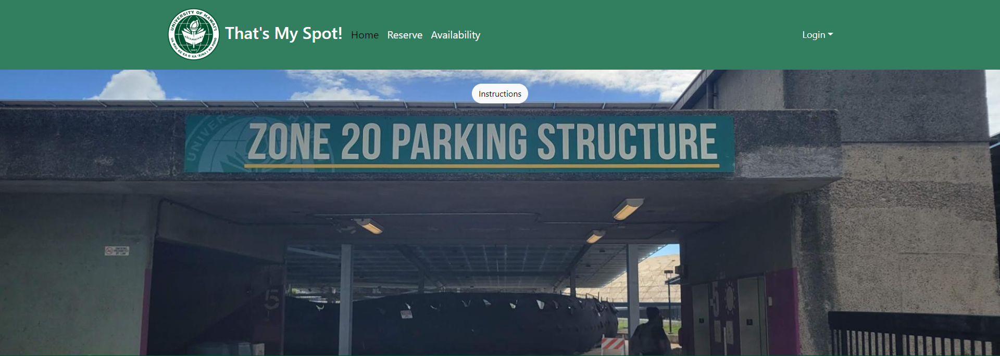
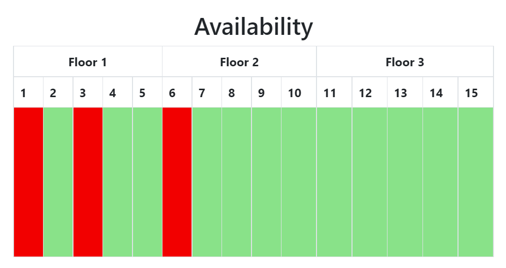

Finding a place to park at UH Manoa is extremely difficult. Although there are many parking zones, they are often inconvenient, and they tend to fill up quickly. That's My Spot! aims to facilitate the parking process on campus by allowing users to reserve a stall, ensuring them a parking space when they arrive to campus.

## Contributions

Much of my work focused on backend and minor project tweaks. I created the GitHub organization and repositories, and added the first milestone project. During milestone 1, I created sign-in/sign-up page drafts. I was tasked with developing the collection of stalls to be reserved by users and displayed to the website's Availability page. I also made various small changes to the project, like proper backend sorting and Navbar changes.

## My Experience

Although our team had a general idea and end goal, the project lacked planning and structure, leading to many delays in production and in-process development. Due to the nature of our schedules, in-person meetings were difficult, forcing us to communicate on Discord or during class hours. Any issues had to be resolved remotely or during specific times in the week. Various hardware complications on my end also impeded my own workflow, affecting the work of teammates who relied on my work.

Despite this, I left the project with a functional website and new insight. Through developmental breakthroughs, our team managed to create a working application, at the cost of omitting some functionality. Some functions of the tentative final product are even improvements over the initial ideas we had with the project. From this project, I learned various software engineering skills like testing, agile project management, and version control. In addition, I learned other valuable things like flexibility, as my expectations and tasks for the project constantly changed; teamwork skills and communication, as working with others, compromising, and communicating was vital to finishing the project; and, most importantly, the value of planning, which would have immensely improved the quality of the final product.

## Future Development

Any future development can see the implementation of features that were not feasible given time constraints. For example, the unused parking pass feature can be used to differentiate users with and without parking stalls, guests would have the ability to see the stall they reserved, etc. Given more time (and planning), these features could have been implemented. As of right now, though, they remain potential features to be added.

## More Information

More information on That's My Spot! can be found <a href="https://thats-my-spot.github.io/">here</a>.

## Team Members

<a href="https://eduardokhojr.github.io/">Eduardo Kho Jr.</a>

<a href="https://gteocson.github.io/">Geoffrey Teocson</a>

<a href="https://yertsti.github.io/">Trey Yasunaga</a>